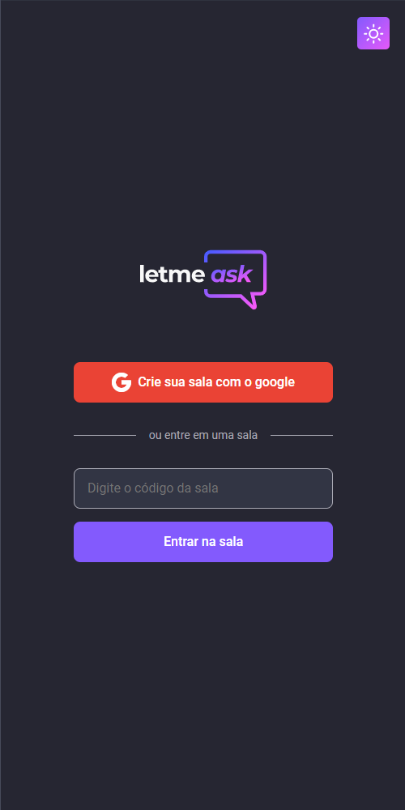
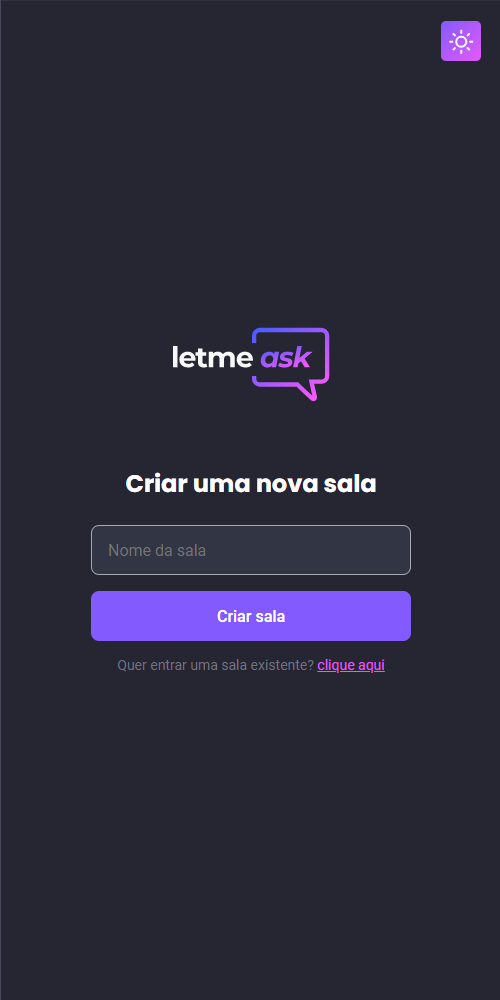
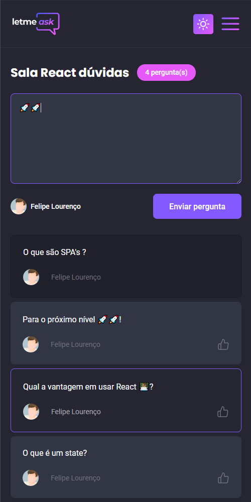
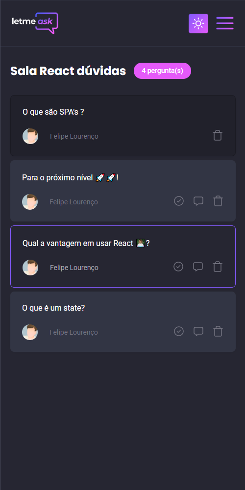
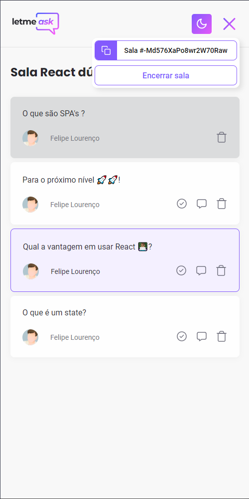

<p align="center">
  
</p>

##

<h1 align="center">
    
</h1>

<p align="center">
  🟣<strong>Letmeask</strong> é um aplicativo para conectar criadores de conteúdo ao seu público, através de um sistema de criação de salas de <strong>Q&A</strong>🟣
</p>

<br>

<p align="center"> Esse projeto foi desenvolvido com as seguintes tecnologias: </p>

<p align="center">
  
  
  
</p>

## 👨🏽‍💻 Como executar

Clone o projeto e acesse a pasta do mesmo.

```bash
$ git clone https://github.com/lipelourencosilva/Letmeask/
$ cd Letmeask
```

Para iniciá-lo, siga os passos abaixo:
```bash
# Instalar as dependências
$ yarn

# Iniciar o projeto
$ yarn start
```
O app estará disponível no seu browser pelo endereço http://localhost:3000.

Lembrando que será necessário criar uma conta no [Firebase](https://firebase.google.com/) e um projeto para disponibilizar um Realtime Database.

##  🚀 Para o próximo nível
<p>
  Para chegar ao próximo nível, desenvolvi algumas funcionalidades extras:
</p>

  - [x] Temas Light e Dark
  - [x] Responsividade

<p align="center">
  
  
  
  
</p>

<h2 align="center">
  
</h2>

  - [x] Menu

<p align="center">
  
</p>

##

<p align="center">
  Feito com 💜 por Felipe, desenvolvido durante a  <strong>Next Level Week Together.</strong> 
</p>
